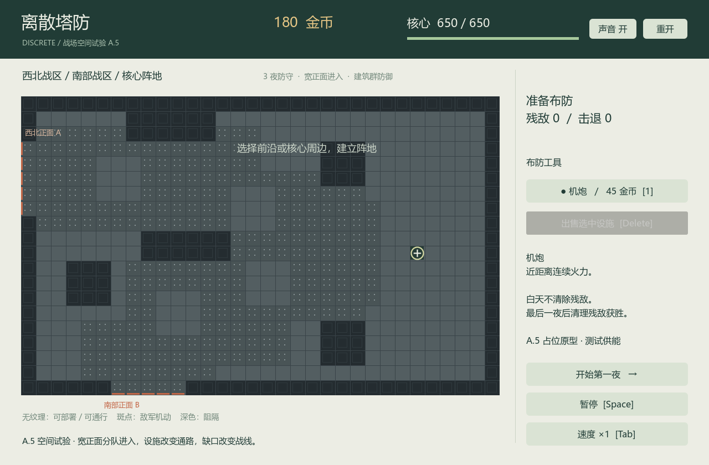
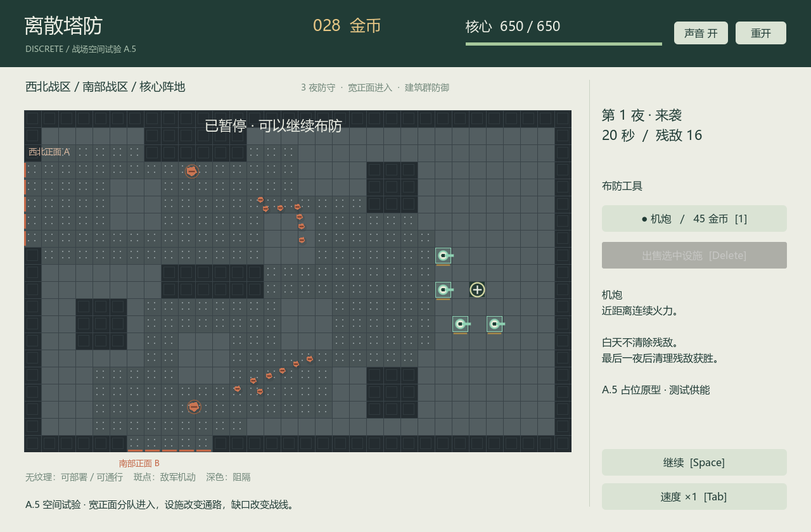

# DEMO A.5：战场空间重构

内部可玩空间原型。目标是建设阵地抵抗军队，尚不是切片 C 的完整产品展示。依据为设计基线 v1.0、用户修订 0003，以及最新的 [战场空间不变量](docs/decisions/0004-战场空间语言.md)。A 的旧空间模型已被取代。

## 游玩

Windows x64 包解压后运行 DiscreteTD.exe，同目录 pck 和 data 文件夹必须保留。无需安装 Godot 或 .NET SDK。导出目录为 build/demo-a5。

左键部署/选择，右键或 Esc 取消工具，1 切换机炮工具，Delete 出售选中设施，Space 暂停，Tab 倍速，R 重开。无纹理灰地可部署，也可被敌人穿越；斑点地面只禁止永久设施，不限制敌军机动；深色块阻挡移动与射击。西北与南部边缘短线标记敌军进入正面。

可以选择前沿据点或核心周围的建筑群。存活建筑阻挡敌军；有通路则绕行，完全封闭则接近、攻击并拆出缺口。堵死通路不是非法建设。核心是可被近战摧毁的建筑。

仍为三个夜晚，夜间 35 秒、日间 20 秒。首夜 A 正面 8 人、7 秒后 B 正面 8 人、15 秒时 A/B 各 4 人。每个宽正面先进入一排，后续排在约 2 秒窗口内跟进；拥堵时延后，日间取消未投放成员，不补发。后两夜分别 36、48 人。最后一夜后清理所有残敌获胜，核心被毁失败。

白天保留残敌和弹体，只复苏已毁永久塔，不给存活塔补血、不凭空补能。建造或复苏与敌人重叠时，尝试将其推到紧邻设施的合法位置，推挤不能穿过其他设施或地形，也不能叠到其他敌人身上。找不到位置时保留实体并持续双向挤压；按敌人与不同塔的接触对结算，多格塔不重复计数，死亡只结算一次。黎明给当时所有存活设施（核心、存活塔、刚复苏塔）短暂无敌，保护期间只免除塔方伤害，不免除敌方挤压伤害。暂用每接触对每秒 24 点双向伤害、2 秒保护，均在 space 配置中待调；暂停不推进这些计时。

## 范围与空间模型

- 32×20 地图，核心 (26,10)，A 西侧连续五格，B 南侧连续五格；西北/南部战区与核心基地分区。
- 地形独立记录 enemyPassable、permanentBuildable、blocksMovement、blocksFire，符号仅为序列化图例。`enemy_maneuver_ground` 是宽阔机动地面。
- 定义包含区域、出生面和分队时序；个体拥有 front、detachment、军团编号、坐标、半径、目标与生命。当前共同目标为核心；没有刚性队形或支援 Buff。
- 机炮、核心、金币、行军体小/中型、原子部署/出售、多格占用、连续圆碰撞、共享动态导航、局部分离、弹体扫掠和占位界面。
- 只用现有机炮。2×2 建筑参与攻墙的夹具不等于新增正式多格塔。

没有新增电网、火炮、维修、高度、天气、神秘、污染、异常、资源点或地图扩展。TestSupply 仍明确标识。所有图形、布局与交互呈现均为验证占位，不是最终美术或交互形态；无参考游戏素材。

地图沿用用户草图；其中不足 32 字符的行在东部基地、最右边界之前补地面，以保持西侧地形和出生坐标，核心独立放置于指定坐标。区域是地图元数据，不给敌人绑定预制轨迹。

## 实现边界

Godot 输入/表现 → Content 强类型校验 → 纯 C# Simulation 权威状态。固定 30Hz、单线程、显示插值；倍速增加相同步数，积压不跳过规则。

每种当前净空共用两张导航成本场：开放场避开存活设施；拆墙场把设施视为高代价可破坏节点。当前只要存在开放路径就优先绕行；不可达才使用拆墙场。八邻接拒绝开放路径的斜角穿缝。每个敌人只查询场和局部空间桶，不单独进行全图搜索。缓存按建筑占用变化失效；建设、出售、摧毁、复苏更新拓扑。地形属性预解析成格子数组，碰撞不临时反复查询定义。

独立单位保持圆形碰撞，用局部分离与分步移动避免相互完全重叠和穿建筑。拥堵会排队，不保证宽度受限处仍维持横向展开，也不强迫补齐队形。目标选择使用实际距离和当前阻挡，不使用全局路径进度。

每步顺序为导航更新、分队投放、建筑重叠推挤/挤压、个体移动/近战与必要的即时拓扑更新、空间索引、TestSupply 充电与射击、弹体伤害、死亡及昼夜边界。核心死亡优先于黎明。

## 构建与检查

Godot 4.7.2 stable .NET（ed1daf0bf）、匹配 Windows 模板；SDK 10.0.401、net10.0；导出包含运行时 10.0.12。Compatibility 渲染。版本锁在 global.json 和 packages.lock.json。

```powershell
dotnet run --project tests/simulation/DiscreteTD.Checks.csproj --configuration Release
./tools/build-demo.ps1 -GodotPath 'C:/tools/Godot_console.exe' -Export
```

可用 -DotNetPath 指定便携 dotnet.exe。省略 -Export 仅编译和装配检查。编辑器入口为 game/client/project.godot，构建自动复制 content/demo-a.json；generated 不可直接编辑。实验数值没有宣称完成平衡。

71 项检查覆盖原有建设/昼夜/胜负及宽正面、分队身份、横向分布、两个推进方向、绕行、完全封闭、同一步破墙开路、一格缺口、斜角缝隙、2×2 攻墙、战斗中出售、建造推挤、无空间时双向挤压、多格接触去重、黎明全局无敌及到期恢复伤害。空防御会失败，测试防线可胜利；可重复同输入结果。

规模探针：i7-12700K、Release、101 设施、实际 1000 敌人，4000 步预热、300 步采样，p95 1.755ms、p99 2.601ms，总线程分配 188,976 字节。101 次拓扑重建包含初始场及准备期建造，并非每名敌人一张场。数值是一次纯模拟观察，不是完整 CPU/GPU、未来电网或 AOE 承诺。

图形核验检查空地图、首支八人分队及两面推进截图；Windows 导出另行做自带运行时启动检查。完整构建结果见本次 PR。另一台干净机器启动与不知设计目标的测试者 30–60 秒盲测仍待实际参与者完成，不将截图或规则测试冒充体验验收。

下一步先收集 A.5 的战场体验反馈，再进入 B；不因本次原型而自动锁定正式镜头、UI 或美术。

## 实际占位画面




