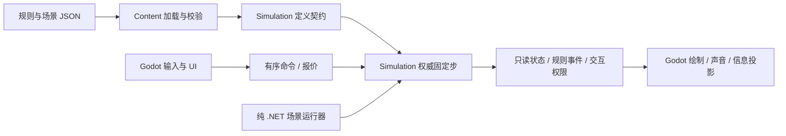

# 架构总览

状态：初始化设计，未实现。规则依据为[设计基线 v1.0](../baseline/v1.0/README.md)，技术选择见[0001](../decisions/0001-技术栈.md)。以下未被 PDF 指定的组织方式为工程约定。

## 依赖与入口

只规划三个生产程序集：`DiscreteTD.Simulation` 无 Godot 依赖；`DiscreteTD.Content` 引用 Simulation 的定义契约；`DiscreteTD.Godot` 引用两者。模块在 Simulation 内部划分，不为每个系统建立程序集、Manager 或总线。测试与纯运行器引用前两者，不启动引擎。

| 模块落点 | 唯一拥有的职责 | 对外边界 |
| --- | --- | --- |
| World | 实体句柄、时钟、命令排序、阶段、胜负、重开 | Step、规划命令、只读视图 |
| Progression | 金币/Q 账目、T/M/P、阈值历史、卡权限 | 原子收支、入账阈值事件、权限查询 |
| Spatial | 实际高度、通行/部署、区域、占格、空间桶 | 占用事务、LOS、范围/扫掠 |
| Construction | 安装、升级、融合、出售；投入继承 | 报价→重验→原子提交 |
| Navigation | 共享方向场、缓存版本 | 导航需求查询，不拥有组任务 |
| Legions | 普通军团任务、支援和补员预算 | 组意图；个体保持独立生命/行动 |
| Anomalies | 全局投放与技能并发、预告锁定、恢复窗 | 给真实异常实体分配施法许可 |
| Energy | 覆盖区、唯一端点、远程口、比例公平、储能、有限脉冲 | 实得能量/功率、守恒账、瓶颈证据 |
| Combat | 射界、三类用能动作、弹体、区域/关系、伤害、控制 | 明确伤害包/特殊移除，不以视觉回调命中 |
| Rituals | 典籍、族准备槽、成员资格、部署 | 与工程/账目事务联动；实体生命周期交给 Lifecycle |
| Pollution | 环境与主动 C、有效 A、维修/抽取预算、污染倾向 | 实际 C 变更、Q 回收请求、失控条件 |
| Environment | 自然/人工天气、昼夜、雷击排程 | 不可变预告与命中前脉冲快照 |
| Lifecycle | 存活、残骸、消耗、死亡派生、清场、复苏 | 原因明确、终结恰好一次 |
| Diagnostics | 规则计数、阶段耗时、账目和事件追踪 | 只读观测；不参与规则决策 |

模块可读取明确的世界数据视图，通过所属系统提交写入；禁止 Energy 和 Combat 各自持有一份电容余额，或 UI 私下维护 Q。局部相互依赖通过固定阶段与专用结果传递解决，不建设任意订阅的全局消息网络。

## 数据与性能

实体用带代数句柄，生成序号用于稳定平局裁决，连续容器下标仅为存储位置。设施、敌人、弹体分别用紧凑可复用数据；定义/名字等冷数据与位置/生命等热数据分开。先简单类型化数组，热点证据充分再拆 SoA；不预造通用 ECS。

静态地图一维数组，设施占格与动态实体索引分开；1×1/2×2、叠装、区域和渲染构件均不改变一个实体一个生命主体。Simulation 使用自有坐标与 .NET 数学类型，不能引用 Node、Resource、Godot.Vector2。

范围、扫掠、治疗、控制复用均匀空间桶及精确检测。真实伤害查询必须扩容或分批处理完整结果；有限近邻只能作为局部避让策略。巨炮扫过路径且按弹体终生去重，炮群按每个事件去重。可回收缓冲、池和批量数据减少 GC，先测密集退化和同帧事件峰值。

导航按目标区域、移动类型、策略、地形/通行版本共享。等代价用反向 BFS，有权代价再用 Dijkstra；多组可共用一场，不能每敌全图寻路或每组永久复制。个体运动每步，组决策可降频但需响应失效。传送/回传重新定位与索引，控制结束恢复任务。

能源拓扑按建设/失效/范围变化维护，请求每步可变。重叠覆盖保留区边界；共享端点耦合的区域不能独立复制求解。详细公平模型见[时序](时序与结算.md)。先正确重算，测图规模与求解次数，再考虑增量/并行。

## 表现与交互

Godot 只把输入映射为命令，消费状态、事件和模拟给出的交互限制。建造预览不直接扣钱；角色动画不发伤害。盲目时玩家信息投影隐藏精确值，不能用其他面板完整绕过；原始调试数据只在明确开发模式可见。迷乱/缄默拒绝命令立即反馈，不积压恢复后自动执行。

相机、暂停、音量、设置、退出和辅助选项属于宿主控制通道，不受异常工程锁影响。显示层按 P 组织 UI/BGM，按 C 驱动构件变形，按真实入账呈现净化回收。世界旋转与视图旋转是不同变换，屏幕角落仪式输入先转世界坐标再验证配方。

静态图元可离线图集，动态构件以少量参数驱动。可先集中管理 Sprite2D，再比较 MultiMesh；按材质与空间块批绘。视野外可不绘，不可停战斗；特效可以合并，规则事件不能丢。选择反查实体句柄，不使用渲染批下标当身份。

## 时间、线程与工具链

工程起点固定 30Hz 模拟，显示独立插值；30Hz 是待验证选择，不是 PDF 数值。2 倍速增加相同模拟步数，不放大步长。积压不跳伤害，记录模拟落后。先同版本同环境可复查，不承诺跨平台逐位确定性。

单线程是正确性基线。出现真实热点才让工作线程读取冻结数据、写独立缓冲，由模拟稳定顺序提交；不逐敌 Task、不并发写共享生命、不碰 Godot 场景。渲染视图借用有效期到下一 Step；若以后跨线程，再明确双缓冲所有权。

首次工程验证完整编辑器/SDK/导出模板组合及无 SDK Windows 启动，再创建工程与锁版本。本轮只有目录职责，没有伪造 csproj、构建命令、性能成绩或自动化通过标记。
