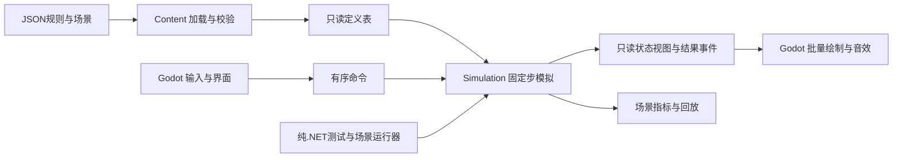

# 技术架构

状态：架构设计 v0.2，2026-09-23；未实现、未跑性能测试。技术选择见[0001](../decisions/0001-技术栈.md)，游戏规则以[项目启动框架](项目启动框架.md)和[核心系统约定](核心系统约定.md)为准。本文决定如何承载规则，不改变M0–M4及E1→E3a→E2→E3b的玩法范围。

## 总体边界

采用单进程、模块化的模拟核心。Godot是程序宿主与表现层，纯C#核心是单局状态的唯一写入者。不为每种塔建立深继承树，也不把每个敌人变成拥有独立规则更新的节点。可扩展性来自明确数据与行为边界，不来自提前制作通用引擎。



只建立三个生产程序集：`DiscreteTD.Simulation`、`DiscreteTD.Content`、`DiscreteTD.Godot`。Content引用Simulation定义的内容契约并构造只读表；Godot引用前两者；Simulation只依赖.NET基础库。先不拆独立Contracts程序集，不让同一程序集承担循环依赖。空间、战斗、能源和区域开放等是Simulation内部模块，不各自变成一个项目或全局单例。

| 模块 | 拥有的数据与工作 | 可见边界 |
| --- | --- | --- |
| Simulation/World | 实体、金币、阶段、时钟、命令顺序 | 提交命令、推进一步、读取状态与事件 |
| Simulation/Spatial | 地形、阶段开放的区域、占格、碰撞几何、动态空间桶 | 足迹事务、开放事件、邻接查询、范围与扫掠查询 |
| Simulation/Combat | 目标、独立冷却、单次动作耗能、弹体、伤害与死亡 | 消费动作许可并原子扣本地电容，产生命中与生命周期结果 |
| Simulation/Navigation | 共享方向场、缓存键、失效版本 | 按导航需求读取方向，不决定波次预算 |
| Simulation/Groups | 行动组任务、角色、局部编队偏好 | 发出组命令；个体仍拥有位置、生命与碰撞 |
| Simulation/Energy | 覆盖拓扑、公平充电、本地电容、可选电池 | 按步提供实得充电功率、电容余额与三类缺能证据 |
| Content | 文件解码、语义校验、稳定ID解析 | 返回完整定义包或带文件/字段定位的错误；不修改运行中的世界 |
| Godot | 输入、窗口、相机、UI、音效、绘制适配、文件入口 | 命令入、状态出，不自行扣费、命中或选取伤害对象 |

边界使用具体值类型和批量调用：`Simulation.Step`、`Command`、`CommandResult`、`FrameView`、`SimEvent`仅是职责示意，尚无API实现。只对已有替换需求设接口，例如测试供能/真实电网、文件读取和渲染适配；内部纯函数无需每个都包装成接口。

## 数据与扩展方式

实体使用带代数的句柄，句柄槽位与连续存储下标分离；存储交换/压缩后更新映射，失效句柄不能误指向复用槽的新敌人。另保存单调生成序号，用于规则要求的稳定排序。塔、敌人、弹体各有可复用的紧凑数组；位置、生命、目标与计时等热数据和名称、说明等冷数据分开。先使用简单的类型化结构数组，确有热点再把特定字段拆为SoA，不造通用ECS调度器。

设施实体与占格分离，多格占用只保存同一实体引用；地图静态格数据使用一维数组。敌人连续位置与圆形碰撞、设施格占用/矩形碰撞、弹体扫掠构成首批几何需求。核心内部使用自己的格坐标与System.Numerics向量，不引用Godot.Vector2、Node或Resource。

内容的足迹、放置条件、背侧支撑、攻击效果、生产、治疗、局部电容/单次耗能和能源端口分别组合。新增同类塔通常只增加JSON定义、视图映射和场景；新增能力种类才增加强类型参数与对应执行系统，同时补边界用例。表现名称不参与技能分派，不能出现按“链”“巨炮”等中文字符串判断玩法的分支。

能力组合有明确时序、互斥与冲突检查。例如混合塔的源、汇、覆盖和转供端口分别记账；同单位不能因为组合两个能力就绕过动作许可。初版只支持已定义的行为集合；未知行为类型拒绝加载，不把JSON升级为任意脚本语言。

JSON使用稳定字符串ID、`schemaVersion`和显式单位。加载时解析到紧凑内部索引并校验引用、数值范围、配方、地形、地图入口及场景模式；每局冻结一份内容包和内容哈希。运行期间不每步读JSON、不按字符串查塔，也不允许热重载静默改变正在进行的战斗。开发时重载在下一次重开生效。

内容数据与呈现映射分开：Simulation只看到内容ID和规则；Godot侧映射ID到纹理、材质与音效。规则JSON由根`content/`维护；打包时显式拷贝至Godot生成目录，并配置JSON导出过滤，干净导出验证不能依赖工作区外的文件。生成目录不是第二份可编辑来源。

## 时间、状态与提交

模拟固定30Hz起步。宿主只有一个时钟驱动器，以累加器消费固定步；暂停不推进模拟，2倍速每秒执行60个相同模拟步。不能同时用Godot物理回调和自有循环各推进一次。渲染独立刷新，在最近两个已提交状态之间插值位置与朝向；出生、死亡和传送类事件显式处理，不能插值出复活单位。

每步仍严格遵守启动框架的顺序：命令/空间变更→支撑和连接→工作请求、网络约束下的公平充电与电容入账→独立冷却→合法生产扣能→生成、组决策、导航与移动→合法开火扣能、弹体与伤害失效→合法治疗扣能→胜负/阶段与区域开放→发布。空间索引在移动后、攻击查询前更新；同一次爆炸先固定命中集合再结算。结构修改在指定阶段提交，不在遍历中任意增删容器。

命令记录模拟步号、同一步内序号和有效载荷。暂停中的规划命令记录在当前步的有序命令批次中，恢复后保持顺序。金币整数化，空间初用浮点；工作进度允许分数供能但统一取整位置。所有平局裁决和事件归并使用稳定序号，随机流显式记录种子和状态。同版本、同环境回放是目标；不承诺跨CPU/平台逐位一致，也不因此引入全世界定点数。

M0在主线程完整推进模拟，随后读取只读视图；视图借用有效期止于下一次Step，不每帧深拷贝整个世界。后续若模拟独立线程，则使用可复用双缓冲/明确所有权交换，不让渲染与模拟同时读写一份可变数组。权威事件和装饰事件分开，粒子队列可合并，伤害/死亡/账目不可丢弃。

限制单次呈现帧的追赶步数，积压保留并记录，不跳过伤害或放大Δt“追平”。持续超预算时可降低视觉更新与装饰密度，仍不允许省略有效目标；必须报告模拟落后，不宣称此时仍维持真实2倍速。

## 四类主要负载

**空间与战斗。** 首选均匀空间网格，格尺度从1个地图格起测；静态地形、设施占用和移动实体索引分开。查询仅扫描覆盖桶，然后做圆/矩形/线段等精确检测，按实体去重。多格塔跨桶仍只命中一次；移动与弹体扫掠包括路径覆盖的桶，不只看终点。巨炮先求本步山体阻挡点，再按截断后的轨迹取得合法命中，维持每发终生去重。

选敌、爆炸、治疗、接触与局部避让复用查询设施，避免每座塔每步遍历所有敌人。精确伤害和合法目标查询不截断结果；结果缓冲不足时扩容或分段处理完整集合，不能悄悄取前N个。空间集中时仍可能退化，尤其邻居避让接近O(N²)；软避让允许采用有限近邻作为显式策略，但伤害、阻挡与接触合法性不能用同一限额截断。探针要包含狭道和密集重叠。

弹体、事件与临时候选缓冲复用，预热后模拟热循环以接近零托管分配为目标；不在逐单位循环里使用分配性LINQ、闭包、字符串格式化和临时集合。穿透命中集合按弹体复用且动态增长，不以性能理由引入隐藏命中人数上限。GC是需要观测的成本，不写“使用C#就没有GC问题”。

**共享导航与兵团。** 按目标区域、移动类型、策略、地图版本共享反向BFS方向场；有代价后再换Dijkstra。缓存计算量依赖不同导航需求数而不是敌人数。组决策可从每6个模拟步一次起测，并响应目标失效事件；个体运动仍每步执行。混合组需要不同停距时可用不同目标区域，但相同需求跨组复用。

短纵列是局部偏好，服从通行、碰撞、接敌与独立死亡；不存一条刚性长碰撞体。区域开放与入口激活也使相关导航结果失效。导航场维护脏版本、引用与内存预算，无人使用的缓存可淘汰，不能每生成一组就永远新建一张图。先同步生成正确结果；以后后台生成必须标记输入版本，陈旧结果丢弃，当前不可通行方向不能继续盲走。确定性回放需固定提交步，不能以线程完成先后决定行为。

**能源。** 覆盖邻接用设施空间索引建立，只在新建、销毁、复苏、位移或范围变化时维护。求解图按可连接部分分区；普通源/汇连接多个覆盖区时共享其唯一容量，因此不能把共享端点误拆为独立网络。保留本地区节点、源注入端、汇消费端与远程总限流口的区别，不把几何连通区直接合并为无限流量区。

E2继续使用带共享端点、远程总限流口的有向容量图，但优化目标改为“网络可行条件下，所有有效充电请求的最大最小公平功率”，不是按编号逐一满足。对请求上限施加同一功率水位，检查是否存在满足该水位的流；触及自身上限或局部瓶颈者固定其分配功率，其他消费者继续提高；允许重新路由已分配的流，不能冻结原路径阻碍余量使用。普通最大流只能判断总可达量，不自行保证公平；具体渐进填充算法需与小图参考解比较，并对重排实体ID/边枚举顺序做不变性检查。流量允许分数P，稳定容差用于数值求解与日志，不能积累能量守恒误差或永久饥饿。

电容状态与网络流解分离。具备必要支撑的可运行攻击塔在每步以 `min(Pmax,(C-e)/Δt)` 请求，冷却中或无目标时也可预充电；满电/损坏/停机/缺必要支撑不请求。维修塔无受伤目标不请求。先求可行分配并充电，Combat随后检查独立冷却和合法目标，成功动作一次扣q。若充电导致恰好达到q，本步可出手；已有电容能在断网后继续支持射击。能力停机、改建和黎明不得凭空增电。TestSupply适配仅满足能源条件，不绕过其他许可。

独立电池先在消费者缺口存在且可改善分配时作为额外源自动放电；否则用可达发电余量充电，不能与消费者抢电或同一步对同一电池充放。初版不允许电池给电池搬运能量。同一连通部分可保守选择放电或充电模式；后续再看实际利用率是否需要更细化。电容负责单发，电池负责时间缓冲，前者不得向电网回送。

拓扑缓存与容量/分配分开。区域开放、建设、损坏或覆盖变化时更新拓扑及导航版本；逐步充电、出手、电池余额、目标意图都会改变请求，需处理每步重求的最坏成本。首版先做正确的重算、测节点/边/可行性检查次数，不预先加入复杂增量最大流或把电网强制降频；容量下降时不能复用超限旧流。区域尚未开放时，不允许范围边跨越封闭格形成隐形供电桥。

UI接收发电、传输、储能三类可并存的证据：较长时间平均发电不足、远程口饱和/断连、峰值时电容等待与电池容量/功率瓶颈。单步请求高于发电额定值不足以证明长期发电不足；诊断可用放宽远程额度的同供给对照，不改变真实分配。性能记录必须显示分区请求/实得、各塔电容与实际动作支出，才能解释巨炮对整区火力的影响。

**绘制与引擎交互。** M0允许集中更新的少量Sprite2D视图，但规则不进入每个节点的_Process。首次规模探针比较集中Sprite2D与MultiMeshInstance2D路径；大量同形敌人、弹体优先批量，UI/选中信息保留普通节点。以类型/材质/空间块分批，记录批次数、缓冲上传字节与透明区域过绘，不只看draw call。

纹理或网格预制紧凑数学母题，每个实例只传位置、朝向、颜色和少量状态。选择通过模拟空间查询回溯实体；批内索引可变，不能当实体ID。批量显示照样保留每个敌人的独立视觉和受击反馈。相机外可省绘制，不能暂停敌人战斗。地图静态层按块缓存，地形变化只重建受影响块；特效与伤害数字单独池化、限流。

## 并行的进入条件

先保持单线程、稳定顺序与阶段计时。若一个纯数据阶段持续超预算，再考虑按不相交空间或独立网络分区派发.NET任务：工作线程读冻结输入，写自己的结果缓冲；主模拟线程按固定顺序提交。禁止每个敌人创建Task，禁止从工作线程修改Godot场景/资源，禁止并发伤害写同一生命值。

优先处理算法与数据局部性，其次批量/分区，最后并行。并行版本必须与基线对照规则结果，并计算快照、调度、归并成本；没有收益就移除。真正需要原生代码时仅替换已定位的纯数据热点，不先建一套C++插件层。

## 工程、资产与保存

下面是进入实现后逐步建立的物理布局，当前不创建空工程。Godot项目位于game/client，避免将测试和全部仓库文件纳入Godot扫描；通过项目引用访问兄弟纯C#库。

```text
game/
  simulation/       DiscreteTD.Simulation.csproj
  content/          DiscreteTD.Content.csproj
  client/           project.godot、DiscreteTD.Godot.csproj、场景与适配
    generated/      内容与运行资产的可重建打包副本
content/            JSON规则、地图、配方、组模板和测试场景
art/source/         SVG等可编辑原稿
art/runtime/        显式导出的PNG、音频等打包输入
tests/simulation/   xUnit规则和小图对照用例
tests/integration/  Godot宿主/导出资源检查
tools/scenarios/    纯.NET确定性场景与指标运行器
docs/               玩法、架构、决策与实测结果
```

场景仅负责相机、绘制层、界面和宿主装配，不在场景文件复制规则表。SVG原稿通过固定导入倍率生成纹理，保证32像素格档位下的线条；运行资产和导入设置纳入版本管理，Godot导入缓存不提交。所有资源路径使用一致大小写和相对路径，Windows通过不等于Linux可用。

存档未来保存版本、内容哈希、规则版本和稳定内容ID，不序列化节点树或连续数组下标。运行时句柄在加载时重建并重映射关联；不同版本需要显式迁移或可理解的拒绝提示。M0只需重开与调试回放记录，不提前实现完整存档、Mod加载器或Steam接口。

## 性能预算与验收

目标是Windows导出Release在1080p下稳定60Hz显示、30Hz模拟，2倍速为60模拟步/秒。首次探针记录并固定一台实际基准机的CPU、GPU、内存、系统、电源模式、驱动和渲染器；最低配置在测量后确定，当前不能承诺具体硬件。

暂定工程预算：常规压力场景每步模拟p95≤4ms、p99≤8ms，CPU整帧p95≤12ms，GPU帧p95≤12ms；完整帧时p95≤16.7ms，并记录p99、超过33.3ms的帧及连续积压。CPU/GPU会流水重叠，预算不可直接相加。分别测1倍和2倍速，持续欠账判为未达标；这些是待校准目标，不是已跑成绩。

| 场景 | 起点与变化 | 检查的瓶颈/正确性 |
| --- | --- | --- |
| P0 最小交战 | M0的4个敌人、1座机炮 | 导出、重开、共享导航、许可与无引擎测试一致 |
| P1 基准规模 | 200座设施、1000敌人；固定种子/地图/命令，先10组后100组 | 组数和不同导航需求数分别记录；测CPU、绘制、分配与缓存复用 |
| P2 热点爆发 | 同区域10/100/1000合法目标；密集爆炸、穿透、死亡 | 真AOE不漏命中；穿透不重复；缓冲扩容和GC尖峰可解释 |
| P3 堵塞与失效 | 狭道、转向、短列伤亡、多组不同目标、场缓存失效 | 空间桶退化、重算风暴、停滞与局部移动耗时 |
| P4 电网 | 200设施中明确源/汇/覆盖比例，重叠区、环路、断网及需求逐步变化 | 本地交换不吃远程额度；公平充电、自动峰值缓冲与守恒；逐步重求的真实成本 |
| P5 扩容探针 | 从P1逐档到5000敌人；弹体密度单独增加 | 找出增长曲线与首个瓶颈，不把5000作为玩法或最低承诺 |

每场预热30秒、采样120秒、至少3次，固定负载生成方案并记录峰值敌人/弹体/事件数；战斗自然消灭敌人时不得仅报初始数量。微基准与真实场景分开。记录各模拟阶段耗时、GC分配/暂停、存活内存、空间候选/命中、导航构建次数、电网节点/边/求解次数、绘制批次与上传量。长时间反复重开检查内存是否回落，不能仅看一次平均FPS。

性能CI先保存指标与基线，在固定运行器上再建立回归阈值；共享云运行器的抖动不直接当硬性能门禁。规则测试必须通过，性能优化不能改变真AOE、断网生效步、优先级或玩家账目。纯.NET运行器隔离算法成本，Godot headless验证装配，导出Release验证完整CPU/GPU链路。

## 第一个实现批次

1. 锁定候选工具链：最小C# Godot宿主引用纯.NET库，验证net10.0编译、headless运行和Windows Release在无SDK环境启动。记录精确版本与导出模板；通过后才提交global.json、项目文件、包锁与真实构建命令。
2. 建立三个生产程序集、内容校验与最小规则用例；完成M0交战。引入实体句柄、连续容器、空间桶与一个共享BFS场即可，不提前做电网求解或编队AI。
3. 在扩充内容前运行P1的占位敌群/绘制探针，决定是否立即切换MultiMesh；此时只能验证已有路径，不能声称验证了尚未实现的真AOE或电网。
4. 随M2/E1/E3a/E2/E3b分别补齐P2/P3/P4的真实负载和边界，出现瓶颈再引入局部并行或数据布局改进。

本次完成的是选型与架构约定。没有新引擎工程、已安装依赖、自动化工作流、运行素材、测试成绩或已发布程序。
