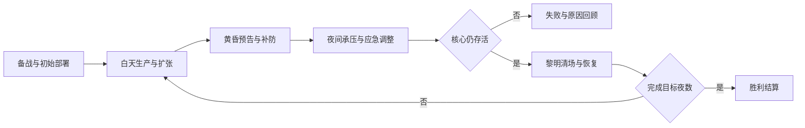
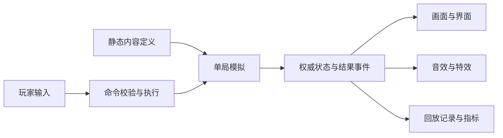

# 项目启动框架

状态：启动设计 v0.4，2026-09-23。已建立独立仓库与文档骨架，并登记参考机制及初始内容集合；已选Godot .NET与独立纯C#模拟核心，尚未创建可运行游戏工程。

**项目定义**

我们制作一款俯视、格子建造的极简生存塔防：玩家围绕一个核心经营生产、建立防线，在逐渐增强的夜间攻势中坚持到黎明。视觉采用灰阶地图、符号化建筑、几何敌群与清楚的战斗反馈。

核心体验和美术风格已有方向；机制细节、内容、数值和技术实现由我们自主设计。目标是做出自己的好游戏。本文件是当前启动依据；之前的原作分析保留为历史参考，其中“继续研究原作”的建议不再作为开发待办。

下文区分两种决定：**体验原则**是现阶段的方向，**V0 默认规则**是为原型设定的可调整起点。改默认规则时记录理由与验证结果，不需要证明它符合原作。

本次确定五项长期约束：高阶塔通过基础设施改建或组合形成；设施至少支持1×1与2×2；地形及邻接条件参与建造和开火；只有一种建设/升级货币，第二种资源为实时生产与传输的能量；范围攻击支持真群伤，敌人采用可共享导航、可演进为兵团的组织模型。具体接口与分期见 [核心系统约定](核心系统约定.md)。这些约束影响 M0 的数据和责任边界，不要求 M0 实现全部玩法。

**体验原则**

| 原则 | 玩家实际感受 | 如何判断是否成立 |
| --- | --- | --- |
| 按关卡分配压力 | 经营关卡权衡近期投入，防御关卡组织持续火力，大型关卡由经营转向高负载防御 | 经济压力与战斗压力分别设定和验证，不要求所有地图都强烈竞争金币 |
| 空间具有代价 | 不同占地、地形、背侧支撑与供能覆盖共同影响布局 | 同样的设施换位置或方向，会改变建造可行性、火力条件与持续运转能力 |
| 防线会失效 | 敌人逐步打坏外层建筑，核心成为最后目标 | 玩家看得见缺口，也能理解敌人为什么从这里突破 |
| 黎明带来恢复 | 即使局部失守，撑到天亮仍有希望 | 恢复前紧张、恢复后有重新安排投资的空间 |
| 简单元素形成规模 | 单个单位容易认，敌群和弹道合起来有压迫感 | 缩远看得懂阵线，放近分得清单位和状态 |
| 敌群具有组织 | 真群伤能够清理密集杂兵，敌人的组合、机动和行动方案仍造成威胁 | 减少纯堆数量的依赖，玩家需要识别优先目标、供能弱点与火力空窗 |

核心体验收敛为：**前期决定把有限资源变成什么，后期决定怎样让已经建立起来的防御体系持续工作。** 关卡可以侧重其中一段，不要求每张图走完同样曲线。新增关卡、敌人或设施必须回答新的布局、投资或持续运行问题，不能只增加资源、塔等级和敌人生命。

**关卡压力的两个维度**

| 典型关卡 | 经济压力 / 战斗压力 | 主要决策与验收 |
| --- | --- | --- |
| 经营压力型 | 经济紧、战斗相对温和 | 金矿、科技与即时防御的投资时机；过度铺矿应在近期产生可解释的防御风险 |
| 防御组织型 | 经济充裕、战斗高压 | 塔组合、巨炮方向、AOE、维修、供能与冗余、兵团应对；允许经济基本解决，布局仍影响成败 |
| 大型综合型 | 前期经营扩张、后期防御高负载 | 前期生产基础支撑后期体系；记录从收入瓶颈转为阵地、输电、充电与维修瓶颈的过程 |

经济参数（初始金币、矿点、收入、建设费用）与战斗参数（单位组合、入口、节奏、任务）分别组织为场景维度，允许交叉组合。早铺矿有利不自动等于全局错误；只有经营压力型的“过度投资无近期代价”等违背该场景目标时才判为需要调整。

**核心循环**



战斗中的选择包括扩充收入、维持供能、布置防线和投资下一阶段能力。高阶塔还会占用基础设施与整块空间。最小闭环先用简化内容验证阶段变化，后续引入这些空间和运行约束；无需复原原作的时长、事件和特殊结算。

**V0 默认规则**

| 主题 | 首版决定 | 设计目的 |
| --- | --- | --- |
| 目标 | 保护一个固定核心，连续度过三夜获胜 | 给一局明确的方向和终点 |
| 阶段 | 备战不计时；白天、黄昏、夜间连续计时；非终局黎明后继续白天 | 建立扩张、预警、承压和恢复的循环 |
| 同时胜负 | 当步战斗先结算；核心归零则失败。核心存活才执行黎明与胜利 | 让最后一刻的规则明确 |
| 货币与能量 | 金币是唯一建造、科技和升级货币；能量属于实时供能系统，不是第二种购买货币 | 分开长期投入与持续运转 |
| 资源来源 | 核心与金矿提供金币；完整能源系统包含发电与远程输电。M0–M2及E1/E3a显式使用测试供能模式，不实现电网经营 | 先跑通闭环，同时禁止业务代码假定建筑永远免费运转 |
| 击杀 | 首版不发通用击杀收入 | 先验证生产经济能否支撑决策 |
| 建造 | 一个实体占用一组格子，V0内容暂全为1×1；检查足迹、地形、占用、金币、科技、部署冷却和配方前提 | 底层支持多格；高阶塔不靠同类数量上限限制 |
| 冷却 | 同类部署共用冷却，与攻击冷却分开；备战免部署冷却 | 防止战斗中无限即时补墙，同时允许开局自由试摆 |
| 升级 | V0先有核心科技和普通数值强化；高阶塔另用基础塔改建/组合配方，不能都塞进等级加一 | 分开数值强化、空间变化和设施替换 |
| 科技用途 | 开局可用围墙、金矿、单体塔；核心升级解锁群攻塔、维修塔及普通建筑强化 | 让科技投资有具体收益 |
| 损坏 | 普通建筑生命归零后停工、不再阻挡敌人，但保留残骸和占格；不能直接在其上重建 | 表达防线失效，同时保留跨夜投资 |
| 修复 | 战斗中的维修只治疗存活设施，不复活残骸；黎明统一复苏残骸并补满设施与核心生命 | 先给战斗治疗和阶段恢复清楚的分工 |
| 出售 | 备战退还实际金币投入；开战后退还75%金币并向下取整；残骸可出售，运行消耗的能量不退款 | 改建继承的投入只记一次，允许调整布局但不能套利 |
| 黎明 | 停止上一阶段待生成敌人，清除在场敌人和弹体，不触发击杀奖励或死亡派生；随后恢复设施；供能启用后重建网络状态 | 不再发放晶体或用阶段结算替代实时供能 |
| 最终黎明 | 存活即胜利，清理战场后展示结算，不再发用于继续经营的阶段奖励 | 终局只有一次结果 |
| 暂停与速度 | 支持暂停、1倍和2倍；暂停时可查看和调整建设，战斗、生产、冷却停止推进 | 原型优先检验决策质量 |

所有退款都取自该设施的实际支付记录。验收时必须排除拆建套利；科技和升级的金币价格必须确认可达。首版不实现降级、消耗品、科技回退和核心出售；基础塔组合、2×2实战设施与电网在后续验证切片加入。

首轮可直接使用 [试跑配置](试跑配置.md)，其中给出初始资源、价格、产率、阶段时长和三夜波次。它用于启动和验证流程，数值尚未试玩调平。

**地图与敌人移动**

采用格子建造、连续位置移动。地形至少区分类型、可提供的功能标签，以及对各移动类型的通行性；不能把“地面单位走不过”写成“所有塔都不能建”。V0内容暂为地面、山体和矿点，金矿只建矿点，其余初始设施只建地面；以后允许部分设施建山上，并依据朝向查询邻接支撑。核心位置与敌人入口由关卡配置。

设施以锚点、朝向、足迹格集合定位，各占用格都引用同一个设施实体。生命、升级、退款和伤害属于实体；不能因2×2占四格而结算四次。多格碰撞轮廓、能力范围、开火位置和选择框由定义派生，不能假设它们都在某个单格中心。

建造时，预定阻挡区不得与活敌人相交；玩家可以补防，但不能把正在穿过的敌人封进新建筑。这个条件由模拟层在实际执行命令时检查。

敌人是独立的可受击、可阻挡单位，每个单位都属于一个行动组。行动组共享目标与导航请求；M0只发布“推进到核心”的命令，相同目标和移动类型复用一份导航场，个体查询方向并处理移动、避让与接触。无需为每个敌人计算、保存一条完整路线，也不把单位表示为按既定轨迹播放的动画。后续在组级增加集结、破口、攻击能源节点、分进合击等决策，不改个体生命和战斗模型。

V0的导航场按静态地形计算，采用“遇设施就接敌”的攻城策略；核心和五种普通建筑在存活时全部阻挡敌人。目标损坏后继续前进。之后可以为兵团增加不同的通行/破障成本策略，不能把当前“忽略建筑规划路径”写成导航服务唯一行为。首版不把真实刚体挤压作为玩法前提。

静态地图必须保证入口到核心有地形通路。建造不会改变基础地形，但会改变设施阻挡和未来的局部战术代价。V0静态路径代价相同，按上、右、下、左的固定方向顺序选取；连续移动先处理本次位移最早接触的建筑，同距离按稳定实体编号取目标。接触攻击期间保持目标，直到目标失效或不再接触，防止反复切换。导航结果按目标区域、移动类型和相关地图版本缓存；同一路线的多个组也可共用。

**大型关卡的渐次开放（后续可选切片）**

逐步开放实际可用区域，而不只遮住信息。前期核心附近少量矿点和入口可用；后续开放外围矿区、山体阵地、新入口和侧翼。新矿区提高经济上限，新山体提供重炮位置，新入口扩大防御面，更远区域增加覆盖、转供与维修负担。开放的价值是机会与责任同时增长。

关卡定义区域、开放条件/阶段、预告信息与入口激活时刻。规则区分“已知但未开放”“已开放”，视觉揭露可以渐进，但进入威胁前须预告区域边界、入口方向和关键任务，提供明确准备窗口；不在揭露瞬间刷出此前不可预测的致命侧袭。首个示例可在黎明开放、到下一黄昏预告/下一夜启用新入口，具体窗口由关卡验证。

首版扩张规则采用预先完整定义的地图、单向开放，不随机生成未知致命区域或回收已开放区域。未开放格不允许移动、建造、选为生成入口或通过其中建立无线连接；为避免跨封锁区偷送电，无线边除范围外还要求沿线格均开放，普通山体仍不因此成为无线遮挡物。跨边界的多格足迹必须全部开放；隔着边界不可攻击未激活区域单位。开放作为阶段边界的原子事件执行，下一模拟步更新导航/供能与入口合法性后才能使用；不删除已有设施，不重复发奖励。

每个可到达的开放阶段都校验激活入口到核心有合法地形通路，显式更新区域/导航/能源版本。预告属于可记录的场景事件，暂停不消耗准备时间。先保留区域ID、开放状态与事件边界；M0–M2仍使用全图开放的静态试跑地图，不先实现迷雾系统或地图编辑器。

**首个可玩版本的内容范围**

| 内容 | 数量与职责 |
| --- | --- |
| 核心 | 1种：生存目标、基础收入与科技入口；后续兼作可独立启动的基础能源源头 |
| 普通建筑 | 5种：单体塔、群攻塔、围墙、金矿、维修塔 |
| 敌人 | 3种基础原型先验证移动、单体/范围伤害；都通过行动组生成。兵团专职单位后续加入 |
| 地图 | 1张，有受地形限制的入口、矿点和可供选择的布防空间 |
| 单局 | 3个昼夜循环；首次试调以含备战约8–12分钟为体验目标 |
| 交互 | 放置、查看、升级、出售、暂停、变速、重新开始 |
| 结果 | 胜负结算，并能看到收入、支出、建筑损坏与核心受伤概况 |

五种普通建筑由功能定义，不绑定原作名称和图标。本轮已按用户要求，从现有资料登记少量可借鉴机制，见[参考机制登记](参考机制登记.md)；它区分资料观察、分析假设和本项目自主设计。

[初始塔与敌人集合](初始塔与敌人集合.md)给出正式内容称呼、稳定ID和分期：基础闭环仍为6种设施（含核心）与3种敌人；完成E1、E3a、E2、E3b后累计10种设施与5种敌人，蓄电池可选。集合中的新增参数是提案，不是已验证平衡；不会扩大M0的实现范围。

单体塔以射程内最近敌人为默认目标，等距按稳定实体编号排序；弹体命中结算一次伤害。群攻塔对落点区域内所有合法敌人各结算一次伤害，不以弹片数或隐藏命中人数上限代替范围伤害，也不按目标数量均摊固定伤害总量。空间查询先取得候选，再精确判定与按实体去重；表现限流不能漏掉受击者。维修塔优先选择范围内生命比例最低的存活友方设施，允许治疗核心，单次只作用于一个目标。围墙自身不攻击。可选目标规则是内容参数，首版不需要玩家配置优先级菜单。

五种普通建筑均纳入 V0 内容；初始可建单体塔、围墙、金矿，核心科技升级后可建群攻塔、维修塔并强化普通建筑。暂不做局外拥有列表和选卡。等可选内容足够多，再引入有限出战槽，避免制作没有取舍的选择界面。

**美术风格规范**

总体方向为正俯视的二维图形风格。灰阶承载地图与敌群，白色承载设施图标，少量颜色承载状态、等级和重点信息。基础资产以自绘矢量、简单精灵和程序图形制作。

| 层级 | 规范 |
| --- | --- |
| 地图 | 低对比灰底与网格；地形用简洁轮廓表达。建造预览应高亮允许地块与缺少的邻接支撑 |
| 设施 | 保持统一图标语言，底座与选择框覆盖实际1×1、2×2等足迹；明确标出朝向、炮口与背侧，选中时显示能源角色与覆盖范围 |
| 敌人 | 统一数学命名，借紧凑轮廓或群体排列体现母题；名称不决定技能，与设施的方框图标语言保持区别 |
| 弹道 | 明确的发射点、运动方向、落点；单体、群攻、治疗具有不同的线条或区域反馈 |
| 状态 | 区分损坏、待充能、缺支撑和正常冷却；能源视图区分发电、传输与储能问题；供能覆盖、连接与瓶颈在选中或能源视图展示 |
| 界面 | 深色面板、清楚的图标与数字；资源、阶段、建造、选中详情分别集中在固定区域 |
| 色彩 | 颜色配合形状或符号使用；同一种颜色不同时承担互相冲突的含义 |

以下是我们的起始色板，不是原作取色结果：背景 `#292B2D`，地块 `#373A3D`，网格 `#464A4D`，主要图标 `#F0F1ED`，敌群 `#B8BCBB`，金币 `#D6B65B`，能量 `#70C9D4`，正向反馈 `#8BCB68`，危险反馈 `#E27970`。能源显示区分供给、需求和传输瓶颈，不画成第二个升级钱包。等级和阵营的用色在美术小样中确定。

以一个格子为比例基准：1×1设施主体初试占格宽的0.72–0.82，普通敌人初试占0.3–0.45；2×2设施按总足迹绘制轮廓，不能在内部留下视觉上可穿行、实际不可穿行的假缝。整套图标统一线宽与视觉重量，先确保最小常用缩放下可辨认。

敌人的比例指单个实体，不能把整支队列挤进单体尺寸或拉成一根长链。链优先用紧凑小兵的短纵列表现连接关系，长轴沿局部前进方向，转弯时逐个转向；环可直接使用闭环轮廓，团、星、树则提炼为紧凑团簇、短放射和短分支。数学图中的装饰节点不自动成为伤害目标，实际队列成员各自是敌人。详见[初始塔与敌人集合](初始塔与敌人集合.md)。

首轮固定两组视觉验收：1920×1080下每格48像素、1280×720下每格32像素。设施主体在较小档位约23–26像素，普通敌人约10–14像素；保持必要描边至少约1个显示像素。保存同一场景的布置、选中、密集交战三种截图，检查核心、五种设施、三类敌人和损坏标记能否辨认。比例不通过就改比例或显示细节，不追求照搬参考图。

敌群还需用短录像检查直行、转弯、停下和成员死亡：短列不能横向拖成长绳，单体之间要能分辨，朝向不能抖动，队列缺口不能被连线或装饰掩盖。先看普通缩放下的动势与轮廓，再决定保留多少数学细节；这些是后续原型验收要求，当前尚无实测结果。

画面信息优先级：核心危险与路径缺口 → 玩家选中/放置反馈 → 单位轮廓 → 攻击方向和状态 → 装饰粒子。伤害数字在密集场面可合并或限流，不能遮掉阵线；视觉粒子上限不会改变实际战斗结果。

初始资产清单：核心图标1个、普通建筑图标5个、敌人轮廓3种、地形符号3类、统一边框与选择框、基础弹体/范围命中/治疗/损坏/黎明效果。升级先使用边框与少量标记变化，不为每级绘制完全不同的塔。

静态风格已足够确定。开火节奏、受击闪烁、昼夜过渡、镜头震动与音效，需要在我们的原型中调校。首先追求方向清楚、响应及时和恢复节奏鲜明。

**技术与逻辑框架**

技术路线已选择Windows桌面优先的Godot .NET＋C#与独立纯C#模拟核心，见[技术栈决策](../decisions/0001-技术栈.md)和[技术架构](技术架构.md)。下列玩法职责保持引擎无关，不把原作Unity版本、DLL、Mod加载器或编辑器工程作为新项目依赖。首次工程先验证并锁定工具链与导出，再落地这些边界。



| 模块 | 自己负责的状态与规则 | 对外提供什么 |
| --- | --- | --- |
| 单局流程 | 阶段时间、夜数、胜负 | 阶段变化和最终结果 |
| 地图与空间 | 地形标签、区域开放状态、实体多格占用、支撑查询、连续位置查询、通行版本 | 足迹校验、邻接条件、碰撞与去重后的范围对象 |
| 经济与部署 | 唯一金币余额、实际投入、科技、部署冷却、改建事务 | 新建/强化/基础塔组合/出售的统一报价和执行结果 |
| 能源与运行条件 | 源/汇/无线覆盖/远程传输组合能力、本地交换区与区间限流、网络约束下公平充电；局部电容与可选电池状态 | 按实体和动作返回需求/实得供能及许可、缺能/缺支撑原因；M0使用显式测试实现 |
| 战斗与生命 | 目标、独立冷却、单次动作扣能、弹体、真范围伤害、治疗、损坏 | 命中、受损、失效事件；发射必须经过动作许可 |
| 波次与行动组 | 阶段生成表、预算、单位角色、组目标与战术命令 | 待生成组及成员；组级决策与个体执行分开 |
| 共享导航 | 按目标、移动类型、策略和版本共享导航场/路线走廊 | 组请求共享结果，个体读取方向并进行局部运动 |
| 内容定义 | 足迹、配方、地形/支撑条件、能耗、攻击效果、兵团模板及关卡参数 | 可校验的静态数据 |
| 表现与输入 | 镜头、选择、面板、动画、音效 | 玩家命令，以及对模拟结果的展示 |
| 记录与调试 | 种子、规则版本、输入、阶段统计 | 同环境复查所需记录和调试视图 |

模块是责任划分，不意味着每个都需要一个全局 Manager。V0 可以使用普通对象和明确的调用顺序；只在出现实际需求时引入更复杂的实体管理、事件框架或编辑器扩展。

电网采用简单源汇流模型：塔可同时发电、耗电、无线供能和远程传输，也可只具备其中一种能力。每座供电塔的范围形成一个本地交换区，区内源汇交换不占远程流量额度；不同区之间按覆盖关系转供，才经过远程限流口。重叠覆盖不自动合并限流边界，纯用能塔不转供。有效消费者按网络可达性尽量等功率充电，电容满足单次动作耗能，冷却独立推进，不设玩家手动供电优先级。可选电池自动以余量充电、缺口放电，缓冲战斗峰值及昼夜供需错位，容量与充放电功率分别约束。详细模型与例子见核心系统约定；M0保留边界，E2再实现求解，随后按需验证储能。

入口和地形由内容定义提供；地图模块校验入口到核心的可达性并提供空间查询；波次模块只使用已校验入口并创建行动组。共享导航不负责波次预算或兵团战术。内容加载器负责组织校验，静态内容本身不更新运行状态。

静态定义与实例状态分开：建筑类型定义价格、足迹、能力和条件，场上建筑保存锚点、朝向、占用格、生命、冷却、投入和供能状态。不能用“一个格子就是一座塔”作为实体模型。界面显示模拟给出的报价与失败原因；执行时再次校验，界面不能自行扣钱或决定胜负。

建造成功必须同时完成扣款、占用整个足迹、创建实例和启动冷却；改建还要原子地消费指定基础塔并转移投入记录。失败则全部不变。出售按实体执行一次，清理全部占格和连接。费用统一使用整数；倍率取整位置由规则统一处理。

攻击先用少量明确的行为：单体弹体、落点范围伤害、单体治疗、周期生产。实例可组合已有行为，特殊单位再增加专门处理。首版无需通用脚本语言或万能技能编辑器。

**推进顺序与可复查性**

模拟使用固定时间步，第一轮以30Hz为可调整起点；显示独立刷新。暂停只允许规划命令，停止计时系统；2倍速执行更多模拟步，不放大单步时间。钱刚好在某步生产到账后，从下一次命令处理起可花费。

暂停时允许选择、查看、建造、普通升级、核心科技升级、出售、调整速度、恢复和重开；涉及建设的操作仍检查当前资源、科技、占格和部署冷却。新建可以启动冷却，但暂停中冷却不会减少；不能用暂停绕过限制。备战可开始关卡，运行中不可手动跳时段、召唤黎明或发放资源。进入胜负终态后仅允许查看、重开和退出，不再接受建设命令。

每步的默认顺序为：处理合法命令及空间变更 → 更新受影响的区域/地形支撑与能源连接 → 根据步初有效工作意图和电容余量求解可用充电功率 → 给有效消费者充电 → 独立推进存活且未停机能力的冷却 → 周期生产检查并扣能产出 → 波次生成、组级决策、共享导航与个体移动 → 目标/支撑等开火条件复查，冷却完成且能量足够则原子扣能发射 → 弹体、伤害与失效 → 治疗合法性复查并扣能治疗仍存活目标 → 核心失败 → 阶段边界/区域开放/黎明/胜利 → 发布结果。治疗目标若已死亡则不扣能。新工作意图下一步申请充电，但本步可用已有电容；暂停中只执行合法规划命令与预览，不充电、不推进冷却。

伤害导致的断网/支撑丢失在本步标记，下一步充电与动作前生效；玩家命令造成的变更本步分配前生效。阶段末开放区域下一步生效，入口不能提前激活。断网不抹去电容，已有能量可继续支撑合法动作；缺支撑仍阻止巨炮发射。已发射弹体不因断电撤销。TestSupply只满足能源条件，其余许可照常执行。

同阶段内的事件按稳定编号排序；核心在伤害结算后归零即失效，后续普通治疗不能把它救回。同一步夜末核心死亡也按此顺序处理。黎明清场不会触发分裂、爆炸等死亡派生；以后若加入此类敌人，应继续遵守这一结算原因区别。

随机种子、命令顺序、内容版本与规则版本需要可记录。V0 争取在同一版本、同一运行环境下重放得到同样结果；不把跨平台逐位一致作为起步要求。规则测试和指标可以不打开渲染界面运行。

**内容组织与项目目录**

仓库按下面的逻辑结构组织，当前只建立顶层职责目录和文档。此图表示职责，Godot宿主与三个程序集的物理布局以技术架构为准，在实现时落地，不先创建空类或引擎工程：

```text
project/
  docs/                 项目定义、规则决定、验证记录
  game/
    simulation/         单局、空间、经济、供能、战斗、行动组与共享导航
    content/            内容定义与加载校验
    presentation/       场景、界面、特效、音效、输入
    platform/           文件、时间、平台接口
  content/
    buildings/ recipes/ enemies/ squads/ maps/ scenarios/
  art/
    source/             可编辑图形原稿
    runtime/            游戏使用的图形与音频
  tests/                规则与关卡边界验证
  tools/                仅按需求增加的导入和调试工具
```

内容用稳定 ID 引用，不以中文显示名作为存档或关联键。检查足迹、配方输入输出、地形/支撑标签、能耗参数和组模板引用，以及费用、冷却、入口和升级可达性。规则采用UTF-8 JSON加载为强类型只读定义，Godot资源只承载呈现映射；无需通用规则脚本引擎。

**数值平衡方法**

先定义一轮白天与一轮夜间中的决策，再给塔和敌人填数值。V0 的初始参数是可调实验值，不从工作簿整表导入。

| 要回答的问题 | 可以借鉴的分析方法 | 必须补上的场景因素 |
| --- | --- | --- |
| 生产来得及回本吗 | 建造成本÷净产率；升级成本÷产率增量 | 第一笔产出时间、离散结算、下一波时间、损坏停产 |
| 围墙能拖住多久 | 生命÷接触伤害速率 | 同时接敌数、维修、攻击间隔和阵线缺口 |
| 升级还是多建 | 增量伤害与增量成本比较 | 占格、覆盖、部署冷却和敌人类型 |
| 真群攻是否值得 | 单次范围效果与攻击周期、能耗比较 | 不限制受击人数；观察敌人散开、机动、耐久、支援配合与火力空窗 |
| 治疗是否有意义 | 有效治疗量与维持的输出时间 | 溢出治疗、治疗对象、瞬间致死、距离 |
| 高阶设施是否值得 | 基础塔累计投入＋改建支出＋占地与配套成本 | 改建会移除多少现有火力；背侧支撑、转向和覆盖连接是否脆弱 |
| 供能能否持续 | 长期动作耗能、充电功率、电容/电池、本地覆盖与远程额度 | 分开检查平均发电、空间传输与时间缓冲；加巨炮是否拖慢整个防区，断网后的电容续射与耗尽时间 |

金币记录长期收支；能量记录供给功率、需求、输电利用率与停机时长，不折算成第二种升级币。高阶塔通过前置建设、空间、配套和运行成本形成取舍，不设置“最多只能建若干座”的常规限制。真群伤成立后，同总预算还要比较兵团组成与行动方案，不能只把下一夜的敌人数加大。

按关卡目标分别验收：经营压力场景比较先生产、先防线、先科技，每类至少3局并保留记录；过度铺矿必须能与稳健投入形成近期损坏/核心风险对照，但允许适度早铺矿明显有利。防御组织场景固定充裕资源，比较阵地、朝向、火力组合、输电冗余和兵团应对，不要求玩家仍为钱发愁。大型综合场景记录每次开放前后的生产增长、防区扩大与后期持续运行压力，不要求每一阶段都经济与防御双重紧张。

先检查规则可复查和至少一条合理通关路径，再按所属类型调整；经营型争取至少两种可解释的投资路线，防御型争取至少两种可解释的布局路线，不把固定三类开局均衡作为所有地图的硬条件。少量试玩不宣称统计胜率；若某方案在同一类型的目标维度上持续无代价占优，再寻找缺失的取舍。

每局记录：经济/战斗压力配置、金币收支与关键投资时刻、核心最低生命、突破方向、实际范围命中与治疗、改建投资、兵团任务与局部突破。能源启用后记录请求/实得充电功率、电容、单发支出、有效射击间隔、电池充放、断连和三类缺能证据；大型地图加区域预告/开放与入口激活时刻。导航记录缓存复用与重算次数。“高DPS”不作为单塔或防区强弱的唯一判断。

**开发顺序与验收**

| 阶段 | 工作 | 达到什么才进入下一步 |
| --- | --- | --- |
| M0 最小交战 | 独立工程；金币单余额、多格足迹表示、条件查询/动作许可入口、行动组与共享导航；只展示1×1单体塔和一种敌人，测试供能 | 最小交战与重开可运行；不是每个敌人单独规划全图；2×2占用可用无美术数据夹具验证，不实现实战巨炮、电网或兵团战术 |
| M1 完整循环 | 金矿、围墙、部署冷却、损坏、黎明、三夜进程；继续用测试供能 | 一局能从备战玩到胜负；只有金币收支，没有晶体钱包或晶体奖励 |
| M2 决策深度 | 核心科技、建筑强化、群攻塔、维修塔、另外两种敌人、出售与退款 | 经济与战斗压力可分别配置；简单数值修改不需要改界面逻辑 |
| M3 风格与反馈 | 落地统一图标、地形、配色、选中提示、弹道、音效和昼夜过渡 | 正常缩放能认出功能，密集交战能看见缺口；外观符合本文件的视觉规范 |
| M4 小范围平衡 | 按关卡类型比较投资或布局，分别调整经济/战斗压力 | 符合该类关卡的决策目标，无建设套利或流程卡死；失败原因可说明 |

美术可在 M0 用少量样张验证，M3 是整套视觉收敛的阶段。不要等所有玩法完成才第一次检查画面比例。

M0–M2是基础闭环验证。内部原型顺序明确为 **M0–M2→E1→E3a→E2→E3b**：E1基础塔组合/2×2与地形支撑；E3a用TestSupply先验证重装、星/树与巨炮/火炮的战斗；E2加入真实电网、公平充电和动作耗能；E3b再验证能源节点侧袭、断网和兵团任务。电池峰值缓冲及昼夜变体作为E2后的可选子切片；大型地图渐次开放在基础空间战斗成立后单独验证，不阻塞M0。编号保留主题含义，各切片落地后再做对应M3视觉/M4平衡复查。

首次性能探针可从同屏200座设施、1000个敌人的人工压力场景起步；后续加入多格设施、集中真AOE、不同兵团数、路径缓存失效及能源连接变更。记录实际硬件、分辨率、模拟步耗时和帧耗时。这是工程测试，不是用敌人数量代替质量压力的玩法目标；不承诺已有性能结果。

**首版必须验证的边界**

- 余额不足、占格冲突、重复点击时，建造和出售不会重复扣款或退款。
- 残骸保留占格但不阻敌；黎明复苏后重新承担阻挡与功能。
- 核心同一步受到致死伤害和遇到黎明时，结果按既定顺序稳定发生。
- 停工建筑不会生产或攻击；暂停不偷偷推进生产、冷却或波次。
- 2倍速改变推进速度，同样命令时序不会改变规则含义。
- 切换阶段清除前夜待生成队列，重开清空旧场景的计时、实体和事件。
- 金币、科技和升级存在可达路径；地图入口没有静态封死。
- 视觉粒子、音效和数字被限流时，实际命中、资源和胜负不受影响。
- 实体跨多个占用格时，伤害、生命、出售和选中仍按一个实体处理；任一格非法不能部分占用或部分扣费。
- 范围伤害按合法实体完整结算；同一敌人不能因为跨格或多个碰撞体重复受同次范围伤害。
- 同目标行动组复用导航结果，个体保留独立碰撞、状态和死亡；组失效不能牵连删除成员。

改建消费、背侧支撑、断电和兵团战术的详细验收随E1、E3a、E2、E3b分别加入；现在只固定接口和数据约束，不要求先完成这些玩法。

这些测试检查规则边界和玩家结果，不围绕无关的内部实现细节扩张测试数量。

**后续扩展顺序**

首个循环通过后，按E1→E3a→E2→E3b验证空间、战斗组合、能源与节点战术；先各做一个代表案例，再扩展塔与敌人数量。其后考虑升级分支、天气和出战组合。局外成长、商店、成就、Mod 支持、编辑器和平台接入按明确需求安排。

扩展内容至少回答一个新问题，例如“需要拦住什么”“什么时候要集火”“值得牺牲哪个格子”。若只是更大数字，优先作为已有单位的参数变化处理。

**参考资料使用约定**

现阶段停止主动研究原版实现、特殊判定和完整参数。没有明确设计问题时，不继续反编译、批量解包、追齐版本或复制完整塔库。

本轮依据用户明确要求，已定向查阅已有的塔与敌人分析材料，登记潜力机制并形成初始集合。此后仍只为具体设计问题查阅少量敌人种类、基础塔职责、视觉参考或数值分析方法；记录“问题、出处与可信边界、采用的启发、我们自己的规则”，不重新启动原作实现调查。参考数据存在缺口也不阻止自主决定。

历史调查、社群工具、原作数据和参考截图保留在原资料目录，不作为本仓库依赖。当前仓库只迁入我们自己的设计；风格规范已在本文中独立说明。

**启动时的第一个实际任务**

按技术架构验证并锁定Godot/.NET工具链与Windows导出，再在本仓库完成M0：用占位图形跑通“放置一座塔→敌人向核心前进→接触与射击→胜负→重开”。验证玩家能否清楚地看见、理解并操作这个过程，并尽早运行占位敌群规模探针。其余内容按里程碑逐步加入。
